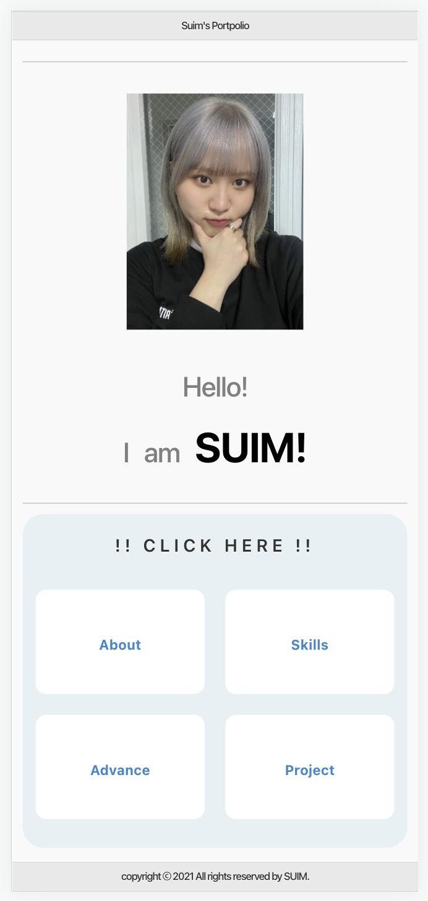
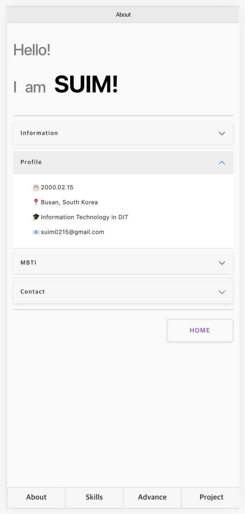
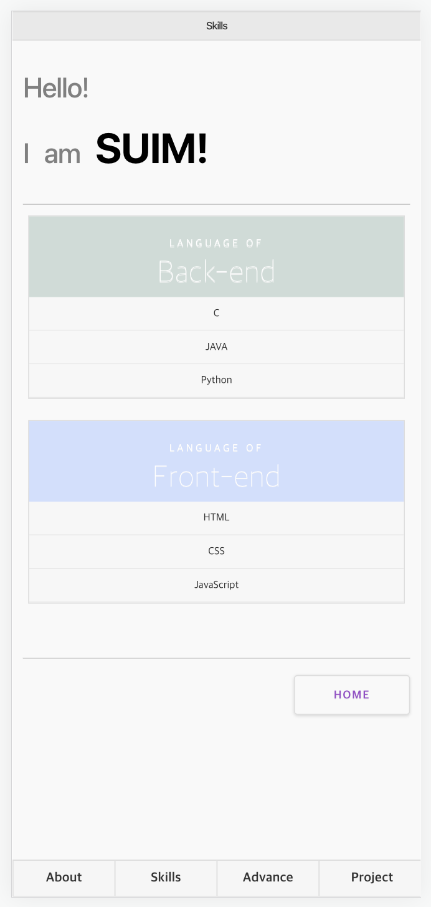
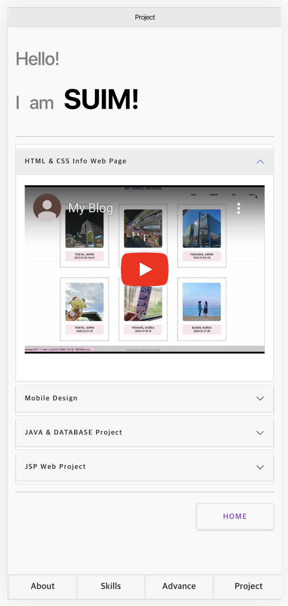

# 모바일 포트폴리오 사이트 제작

## 📷 Preview
<p align="center">
    <figure class="third">
        
        
        
        
    </figure>

🔗 [바로가기 Click !!](https://grand-duckanoo-55f69f.netlify.app/)
</p>


<br>

## 🫢 프로젝트 소개

<p align="justify">
  이전에 작성했던 포트폴리오 페이지를 모바일 반응형으로 제작해보았습니다.<br>
  
  1. About: 자기소개와 신상정보를 넣었습니다.<br>
  2. Skills: 제가 사용할 수 있는 언어목록입니다.<br>
  3. Project: 제가 그동안 진행 / 완료한 프로젝트 목록입니다.

</p>

<br>

## 🤭 디렉토리 구조

<p align="justify">
  
  + **/img**: 웹 페이지와 md 파일에 사용된 이미지 파일이 들어있습니다.
  + **/css**: 웹 페이지에 사용된 css 파일이 들어있습니다.
  + **/js**: 웹 페이지에 사용된 js 파일이 들어있습니다.
</p>

<br>

## 🫢 사용 언어 및 프로그램 및 프레임워크

|    HTML    |     CSS    |   vscode   | 
| :--------: | :--------: | :--------: | 

| Bootstrap5 |  Bulma | Milligram |  Pure  |
| :--------: | :----: | :-------: | :----: |

<br>

## 🤭 프레임워크 적용 화면

#### 👉🏻 jquery moblie 
<p align="justify">
  <figure class="third">
        
        
    </figure>

```
<div data-role="page">
    <div data-role="header">
    .
    .
    </div>
    <div data-role="content">
    .
    .
    </div>
    <div data-role="footer">
    .
    .
    </div>
</div>
```
  위 형태의 틀을 기본으로 적용하여 모든 화면에서 사용되었습니다.
</p>

<br>

#### 👉🏻 Bootstrap
<p align="justify">
  <figure class="third">
        
        
    </figure>

  아코디언 메뉴바를 사용하여 각 콘텐츠를 분류하였습니다.
</p>

<br>

#### 👉🏻 Bulma
<p align="justify">
  <figure class="third">
        
    </figure>

  메인화면의 Click Here 부분의 각 div를 columns is-mobile로 적용하였습니다.
</p>
<br>

#### 👉🏻 Pure
<p align="justify">
  <figure class="third">
        
    </figure>

  Skill 카테고리 화면의 표 형식 레이아웃을 사용하였습니다.
</p>
<br>

#### 👉🏻 Milligram
<p align="justify">
  모든 화면의 HOME 버튼을 밀리그램 버튼 속성을 적용하였습니다.
</p>
<br>

## 🫢 배운 점 & 아쉬운 점

<p align="justify">
   저는 평소에 프레임워크를 사용하는 것을 선호하지는 않았습니다. 프레임워크를 사용하면 제가 수정을 필요로 하는 부분의 css를 수정할 수 없다고 생각했기 때문입니다. 그러나 이번에 이 페이지를 작성해보며 프레임워크를 사용해도 필요한 부분의 css를 수정할 수 있다는 것을 알게 되었습니다. 그리고 css 프레임워크는 디자인이 별로다라는 편견이 있었는데 완성된 페이지를 보니 디자인도 잘 나온 것 같아서 그러한 편견도 사라진 계기가 되었습니다. 앞으로 종종 배우고 싶거나 참고하고 싶을 때 이 프레임워크들을 찾을 것 같습니다.
   <br>
  <br>
  그러나 여러가지의 css 파일과 js 파일이 엮인 만큼, 하나를 설정하고 하나를 추가하고 할 때마다 페이지의 속성들이 미세하게 틀어지는 부분이 있어서 그 점은 어려웠던 것 같습니다. 이 부분은 제가 미리 구상을 할 때에 모든 css를 연결해놓고 시작했더라면 더 수월하게 제작했을 것 같아 아쉬운 마음이 듭니다. 이 배움을 바탕으로 더 나은 코딩 습관과 프론트엔드 제작 방향이 잡힌 것 같습니다.
</p>

<br>

## 👍🏻 License

  MIT &copy; [SUIM](mailto:suim0215@gmail.com)

